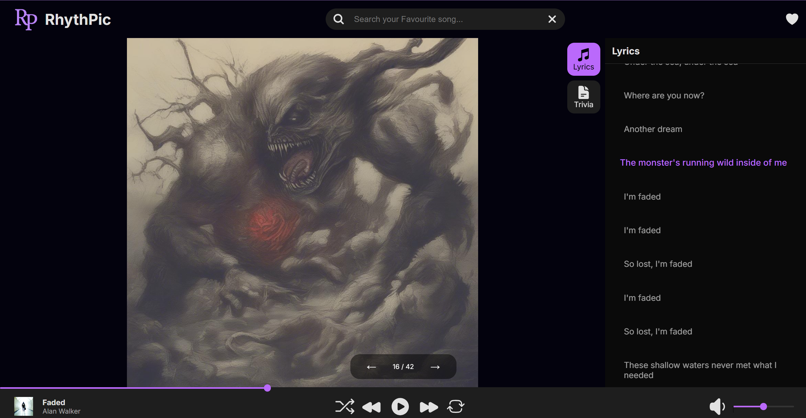

# 🎵 RhythPic - AI-Generated Visuals for Your Music  

**RhythPic** is an innovative platform that enhances your music experience by generating AI-powered visuals synced with song lyrics. By extracting real-time lyrics from Spotify, RhythPic brings each song to life with AI-generated images that align with the emotions and themes of the lyrics.  

## 🚀 Key Features  

- 🎶 **Real-time Lyrics Processing** – Fetches time-coded lyrics from a dedicated API.  
- 🖼 **AI-Generated Visuals** – Creates unique images based on the meaning and mood of each lyric.  
- 📊 **Playback Dashboard** – Tracks your music history, playback statistics, and AI-generated content.  
- 🌟 **Interactive User Experience** – Offers real-time, synchronized lyric-to-image transitions.  
- 📌 **Personalized Playlists** – Allows users to curate AI-enhanced playlists.  
- 🔔 **Notifications & Suggestions** – AI-based recommendations for music and imagery.  

---

## 📷 Screenshots  




---

## 🛠️ Tech Stack  

- **Frontend:** React, Tailwind CSS  
- **Backend:** Node.js, Express.js  
- **Database:** PostgreSQL  
- **AI Integration:** Local Hugging Face Stable Diffusion APIs  

---

## 🚀 Getting Started  

### 1️⃣ Clone the Repository  
```sh
git clone https://github.com/skris56uic/RhythPic.git
cd RhythPic
```

### 2️⃣ Install Dependencies  
```sh
npm install
```

### 4️⃣ Run the Application  
```sh
npm start
```
The app will be live at `http://localhost:3000/`.  

---

## 🎯 Future Enhancements  

- 📽 **AI-powered video generation** for enhanced visual experiences.  
- 🎨 **User-customized themes** for visuals based on music genre.  
- 🔄 **Offline Mode** – Allow pre-generated visuals for offline playback.  

---

## 🤝 Contributing  

Want to contribute? Fork the repository and submit a pull request!  

---

## 📄 License  

This project is licensed under the MIT License.  

---

🔥 **Enjoy a new way to experience music with RhythPic!** 🎶🖼  
